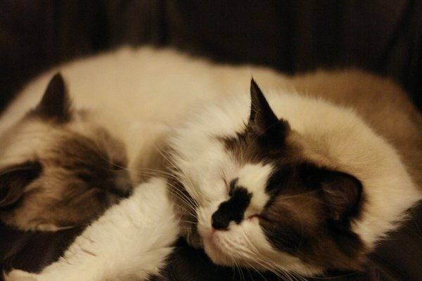

# Daniel's Github Page for Lab 1
### Useful section link that will bring you to the section immediately below this one in case your scroll wheel is broken
[Useful Link](https://github.com/DanielwasTaken/DanielwasTaken.github.io/blob/main/index.md#random-link--image)
### Random Link + Image
Here are [104 Cat Facts](https://www.factretriever.com/cat-facts) that I read before working on this lab

Here is a cat picture to accompany it



A not so wise man creating this page once said
> Cats are pretty alright

The same not so wise man also once said
> **bold** and *italic* text looks nice 

Here is a nice [relative link to the same cat photo](./catpic.jpg)

### My coding masterpiece

```
public class bigbrainstuff
{
  public static void main(string args[])
  {
      system.out.println("Hello world");
  }
}
```

### My top 3 novel translations I read in 2020
1. Lord of The Mysteries
2. Release That Witch
3. Reverend Insanity

### My Genshin Impact task list for this week
- [x] Beat Wolf
- [ ] Beat Dragon
- [x] Beat Childe
- [ ] Farm Geo Boss
- [ ] Farm Electro Artifact Set
